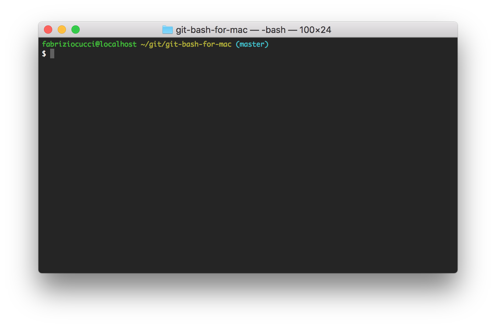

# Git Bash for Mac

Did you (finally) migrate from Windows to Mac and the only thing you miss is the lovely Git Bash?
You have no idea what the Git Bash is (or Windows for that matters) and yet you really want to improve your Git experience on Mac?

Here it comes the *Git Bash for Mac*: a nice `Terminal` customisation that always shows you the branch you are on, powered by a tab-based autocompletion for all of Git’s subcommands, command-line parameters, and remotes and ref names.



### Install

Follow these steps:
1. from the `Terminal`, run
```shell
/bin/bash -c "$(curl -fsSL https://raw.githubusercontent.com/fabriziocucci/git-bash-for-mac/master/install.sh)"
```
2. open `Terminal` -> `Preferences` -> `Profiles` and select the `Pro` theme;
3. restart the `Terminal` and enjoy!

### Uninstall

Follow these steps:
1. from the `Terminal`, run
```shell
/bin/bash -c "$(curl -fsSL https://raw.githubusercontent.com/fabriziocucci/git-bash-for-mac/master/uninstall.sh)"
```
2. open `Terminal` -> `Preferences` -> `Profiles` and select the theme you used to have;
3. restart the `Terminal` and (un)enjoy!

### Customize

You don't like the colors of your new prompt? Open `~/.git-bash-for-mac.sh` and start messing up with it!

In addition, by simply exporting a couple of variables in `~/.git-bash-for-mac.sh` you can make you prompt even more informative:
* if you set `export GIT_PS1_SHOWDIRTYSTATE=1`, unstaged (*) and staged (+) changes will be shown next to the branch name;
* if you set `export GIT_PS1_SHOWSTASHSTATE=1` and something is stashed then a '$' will be shown next to the branch name;
* if you set `export GIT_PS1_SHOWUNTRACKEDFILES=1` and there are untracked files then a '%' will be shown next to the branch name.

More info and options can be found [here](https://git-scm.com/book/en/v2/Appendix-A%3A-Git-in-Other-Environments-Git-in-Bash).
